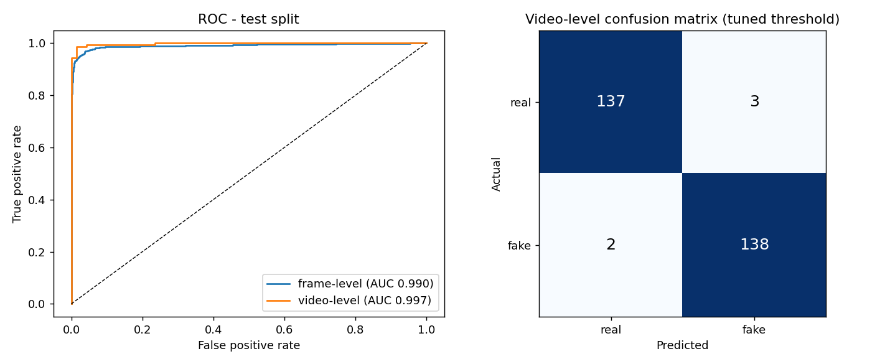
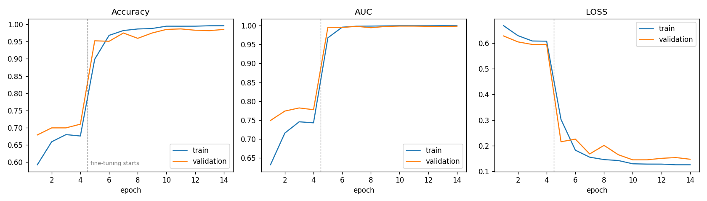

# Deepfake Detection System

A CNN pipeline that flags manipulated (deepfake) faces in videos. It finds the face in each frame with OpenCV, classifies the face crop with a fine-tuned EfficientNetB0, and combines the frame scores into one verdict for the video. The full pipeline runs at **~47 FPS** on a laptop RTX 4050, so it can work in near real time on video files or a webcam.

**Tech stack:** Python · TensorFlow / Keras · OpenCV · scikit-learn · ONNX Runtime Web

**Live demo: [harsh-deepfake-detector.vercel.app](https://harsh-deepfake-detector.vercel.app)**. Upload a video or use your webcam.

There is also a **website** ([`web/`](web)) where you can upload a video or use your webcam. It runs the same detector **entirely in the browser**, so no video is uploaded anywhere. See [Website](#website-vercel).

## Results

All numbers below are on the held-out **FaceForensics++ test split** (c23 compression; original vs. *Deepfakes* manipulation). It contains 140 real and 140 fake videos of identities the model never saw during training. Thresholds were tuned on the validation split only.

| Level | Accuracy | Precision | Recall | F1 | ROC-AUC |
|---|---|---|---|---|---|
| Frame (3,360 face crops) | **96.3%** | 97.2% | 95.4% | 96.3% | 0.990 |
| Video (280 videos) | **98.2%** | 97.9% | 98.6% | 98.2% | 0.997 |

- **False positives down 18.8%:** at the frame level, moving the decision threshold from 0.50 to the value tuned on validation (0.604) cut real faces wrongly flagged as fake from 58 to 47 (FPR 3.45% → 2.80%). Accuracy rose slightly at the same time.
- **Real-time speed:** end-to-end throughput (decode, face detection, CNN) averaged **46.9 FPS** (min 32 FPS) across 6,000 frames from 20 test videos. Hardware: RTX 4050 Laptop GPU, TensorFlow 2.10.
- **Training data:** 17,279 face crops from 1,440 training videos. Including validation and test, the pipeline extracted 23,999 face crops in total.




Raw numbers: [`reports/metrics.json`](reports/metrics.json) · [`reports/benchmark.json`](reports/benchmark.json) · [`reports/training_log.csv`](reports/training_log.csv)

> **Scope.** The model was trained and tested on one manipulation method (FaceForensics++ *Deepfakes*). Like most detectors trained on a single dataset, it should not be expected to generalise to unseen generators (e.g. diffusion-based face swaps) without training on more data.

## How it works

```
video ──► sample frames ──► YuNet face detector ──► 224×224 face crop (1.3× margin)
                                                           │
                                                           ▼
                               EfficientNetB0 (ImageNet-pretrained, fine-tuned)
                                                           │
                                         per-frame P(fake) ─┤
                                                           ▼
              frame label (tuned threshold)  +  video verdict (mean of frame scores)
```

1. **Frame and face extraction** ([`scripts/extract_faces.py`](scripts/extract_faces.py)): samples 12 evenly spaced frames per video, detects the largest face with OpenCV's YuNet, and saves a square crop. A margin is added around the face so the blending boundary of a face swap stays in view. Splits follow the official FaceForensics++ identity pairs, so no person appears in both train and test.
2. **Model** ([`src/deepfake_detector/model.py`](src/deepfake_detector/model.py)): EfficientNetB0 backbone, global average pooling, dropout, and a sigmoid output.
3. **Training** ([`scripts/train.py`](scripts/train.py)): runs in two phases. First only the head trains on a frozen backbone (4 epochs). Then the top 120 backbone layers are fine-tuned at a lower learning rate, with BatchNorm kept frozen. Training uses mixed precision, label smoothing, and augmentation (flip, colour jitter, and random JPEG re-compression to mimic shared videos). The best checkpoint is picked by validation AUC.
4. **Threshold tuning and scoring** ([`scripts/evaluate.py`](scripts/evaluate.py), [`src/deepfake_detector/scoring.py`](src/deepfake_detector/scoring.py)): the threshold that maximises balanced accuracy on validation is chosen. Every threshold inside the optimal interval gives the same predictions, so the midpoint of that interval is used rather than its edge. Frame scores are aggregated into a video score. Mean and confidence-weighted aggregation were both compared on validation.
5. **Inference** ([`src/deepfake_detector/detector.py`](src/deepfake_detector/detector.py)): processes every frame. The model runs as a traced `tf.function` to remove Keras per-call overhead. A smoothed per-frame score is drawn on the video, and a video-level verdict with confidence is reported.

## Quick start

Requires Python 3.10. On Windows, the pinned `nvidia-*-cu11` wheels in `requirements.txt` provide the CUDA 11 runtime that TensorFlow 2.10 needs for GPU support. No system-wide CUDA install is required. Without a GPU it runs on CPU, just slower.

```bash
python -m venv .venv
.venv\Scripts\activate          # Linux/macOS: source .venv/bin/activate
pip install -r requirements.txt
```

The trained weights (`models/deepfake_effnetb0.weights.h5`, 17 MB) and the YuNet face model are included, so detection works right after cloning:

```bash
python detect.py path/to/video.mp4                       # verdict + confidence + FPS
python detect.py path/to/video.mp4 --output annotated.mp4
python detect.py 0 --show                                 # live webcam, press q to quit
```

Example output:

```
Verdict:          FAKE
Fake probability: 0.972  (threshold 0.448)
Confidence:       97.2%
Frames analysed:  449/449 with a face
Throughput:       27.7 FPS     # lower here because it is also encoding the annotated video
```

## Website (Vercel)

[`web/`](web) is a static site, so no server is needed. It exports the trained models to ONNX and runs them with [ONNX Runtime Web](https://onnxruntime.ai/docs/tutorials/web/) (WebAssembly). The runtime is self-hosted in `web/vendor/ort` because threaded WASM workers must come from the same origin:

| Component | Browser implementation | Verified against |
|---|---|---|
| Classifier | EfficientNetB0 exported with `tf2onnx` ([`scripts/export_web_model.py`](scripts/export_web_model.py)), 16 MB | Keras: max output difference **6.9e-6** on 512 test faces, 100% decision agreement |
| Face detector | YuNet ONNX plus OpenCV's post-processing re-implemented in [`web/js/yunet.js`](web/js/yunet.js) (anchor decoding, scoring, NMS) | `cv2.FaceDetectorYN`: max box difference **3.8e-5 px** (numpy reference, [`scripts/yunet_reference.py`](scripts/yunet_reference.py)). JS port matches the reference to **5.6e-6** ([`tests/web_parity.mjs`](tests/web_parity.mjs)) |
| Full pipeline | [`web/js/detector.js`](web/js/detector.js): same 480 px detection, 1.3× crop, 224 px input, tuned thresholds | 6 held-out test videos (3 real, 3 fake): all classified correctly. Mean scores were within 0.025 of the Python pipeline |

Uploaded videos are sampled at 32 frames. The page shows a per-frame probability timeline, the face crops the model saw, and a video-level verdict. Webcam mode runs live with smoothing. On a laptop CPU, one thread of WebAssembly takes about 80 ms per frame. `web/vercel.json` sets the COOP/COEP headers that enable multithreaded WASM on Vercel.

```bash
python scripts/export_web_model.py      # Keras -> ONNX + parity check
python scripts/yunet_reference.py       # YuNet decoding vs OpenCV (+ local fixtures)
npm install && npm run test:web         # JS YuNet port vs Python reference
python scripts/serve_web.py 8200        # static server with the same COOP/COEP headers as Vercel
```

**Deploy:** import the repo in Vercel, set **Root Directory** to `web`, set Framework Preset to *Other* with no build command, and click Deploy.

## Reproducing the results

```bash
# 1. Download 1,000 real + 1,000 Deepfakes videos (~4 GB) from FaceForensics++ c23
python scripts/download_ffpp.py --out data/raw --methods Deepfakes

# 2. Extract face crops into train/val/test using the official splits
python scripts/extract_faces.py --frames-per-video 12

# 3. Train (about 10 minutes on an RTX 4050)
python scripts/train.py

# 4. Evaluate on the test split and tune thresholds on validation
python scripts/evaluate.py
python scripts/plot_training.py

# 5. Measure end-to-end FPS
python scripts/benchmark.py --videos 20

# Unit tests
python -m pytest tests
```

The download script streams only the requested folders out of the 18 GB archive using HTTP range requests. FaceForensics++ is distributed under its own [terms of use](https://github.com/ondyari/FaceForensics). No dataset videos or frames are included in this repository.

## Project structure

```
├── detect.py                    # CLI: run detection on a video or webcam
├── web/                         # static website: ONNX models run in the browser (Vercel)
├── src/deepfake_detector/
│   ├── env.py                   # Windows CUDA DLL setup before importing TensorFlow
│   ├── faces.py                 # YuNet face detection, cropping, frame sampling
│   ├── data.py                  # tf.data pipeline + augmentation
│   ├── model.py                 # EfficientNetB0 classifier
│   ├── scoring.py               # frame-to-video aggregation, threshold tuning
│   └── detector.py              # real-time video inference
├── scripts/                     # download, extract, train, evaluate, benchmark
├── models/                      # trained weights, inference config, face detector
├── data/splits/                 # official FaceForensics++ train/val/test pairs
├── reports/                     # metrics, plots, training logs
└── tests/
```

## References

- Rössler et al., *FaceForensics++: Learning to Detect Manipulated Facial Images*, ICCV 2019.
- Tan & Le, *EfficientNet: Rethinking Model Scaling for Convolutional Neural Networks*, ICML 2019.
- Wu et al., *YuNet: A Tiny Millisecond-level Face Detector*, Machine Intelligence Research 2023.

## License

Code released under the [MIT License](LICENSE).
